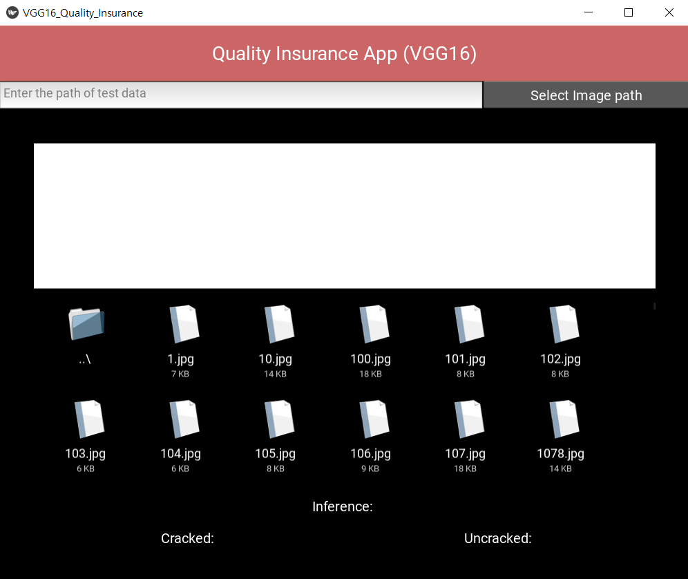
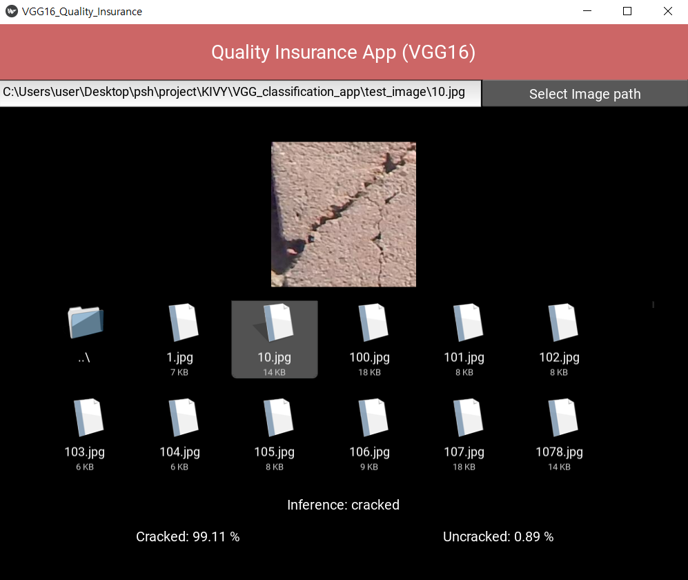
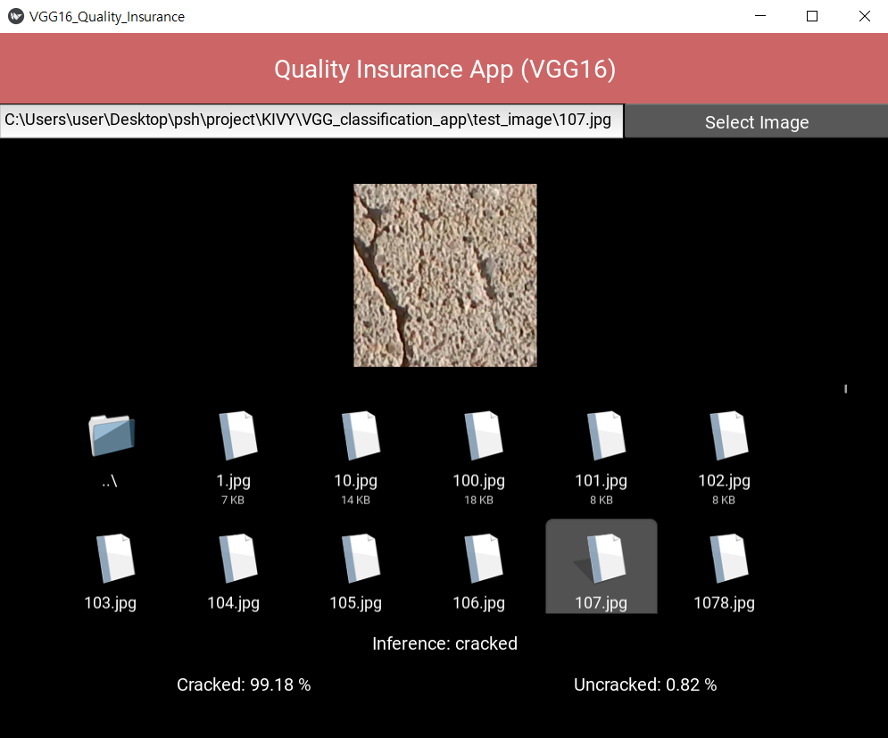
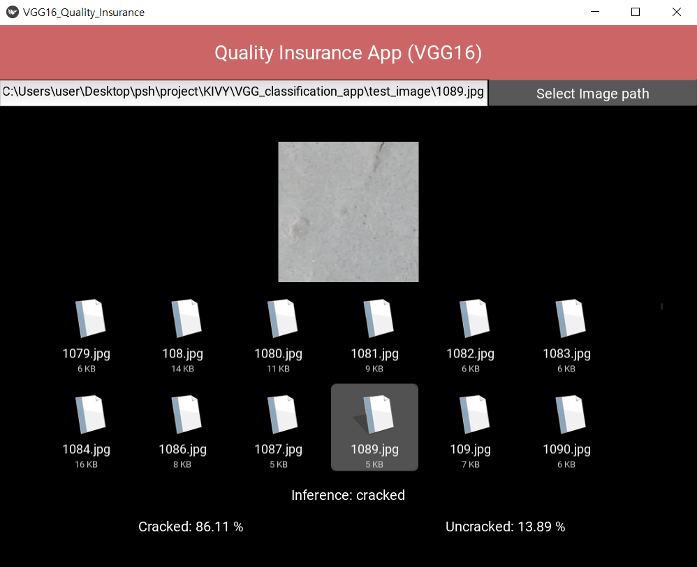

# Image-Classification-App-VGG16 🖼️📊
An interactive Kivy-based application that uses a VGG16 neural network to classify images as cracked or uncracked. Designed for quality assurance and defect detection tasks, this tool offers an intuitive interface and reliable predictions.

# VGG16 이미지 분류기 🖼️📊
VGG16 신경망을 활용하여 이미지를 균열(cracked) 또는 비균열(uncracked)로 분류하는 Kivy 기반 애플리케이션입니다. 
품질 보증 및 결함 감지 작업에 적합하며, 직관적인 인터페이스와 신뢰할 수 있는 예측 결과를 제공합니다.

<table>
<tr>
    <td align="center">
        <h3>Home Screen</h3>
        
    </td>
    <td align="center">
        <h3>Operation 1</h3>
        
    </td>
</tr>
<tr>
    <td align="center">
        <h3>Operation 2</h3>
        
    </td>
    <td align="center">
        <h3>Operation 3</h3>
        
    </td>
</tr>
</table>


<details>
<summary>README (한국어)</summary>

## 주요 기능 ✨
- **이미지 선택 및 미리보기**: Kivy UI를 통해 이미지를 선택하고 미리볼 수 있습니다.
- **VGG16 모델 추론**: 사용자 지정 모델을 활용하여 이미지가 균열인지 비균열인지 분류합니다.
- **결과 시각화**: 예측된 라벨 및 확률을 직관적으로 표시합니다

---

## 사용된 라이브러리 및 도구 📋
- **PyTorch**: VGG16 모델과 전이 학습 구현.
- **torchvision**: 데이터 전처리와 이미지 변환.
- **Pillow**: 이미지 파일 처리.
- **Kivy**: GUI 개발.

Tkinter: 파일 선택 대화 상자.
---

## 설치 및 실행 방법 ⚙️
1. **필요 라이브러리 설치**
   ```bash
   pip install torch torchvision kivy pillow
2. **어플리케이션 실행**
   ```bash
   python main.py

## 기대 효과 🎯
- **효율성 증대**: 직관적인 UI와 빠른 추론 시간으로 품질 보증 작업의 효율성을 높입니다.
- **다양한 활용 가능성**: 균열 감지 및 상태 분류 작업에 적합..

## 기여 방법 🤝
1. 이 레포지토리를 포크합니다.
2. 새로운 브랜치를 생성합니다: ```git checkout -b feature/your-feature-name```
3. 변경 사항을 커밋합니다: ```git commit -m 'Add some feature'```
4. 브랜치에 푸시합니다: ```git push origin feature/your-feature-name```
5. 풀 리퀘스트를 생성합니다.

## 라이선스 📝
이 프로젝트는 MIT 라이선스를 따릅니다. 자세한 내용은 [LICENSE](./LICENSE)를 참조하세요.
</details>

---

<details> <summary>README (English)</summary>
  
## Key Features ✨
- **Image Selection and Preview**: Select and preview images via an intuitive Kivy UI.
- **VGG16 Model Inference**: lassify images as cracked or uncracked using a custom-trained VGG16 model.
- **Result Visualization**: Display the predicted label and probabilities clearly.

---

## Libraries and Tools Used 📋
- **PyTorch**: For implementing VGG16 model and transfer learning.
- **torchvision**: For data preprocessing and image transformations.
- **Pillow**: For handling image files.
- **Kivy**: For GUI development.
- **Tkinter**: For file selection dialogs.


## Installation and Execution ⚙️
1. **Install Required Libraries**
   ```bash
   pip install torch torchvision kivy pillow
   
2. **Run the Application**
   ```bash
   python main.py

## Benefits 🎯
- **Improved Efficiency**: Enhances quality assurance workflows with an intuitive UI and fast inference times.
- **Versatile Applications**: Suitable for crack detection and condition classification tasks.

## Contribution 🤝
1. Fork this repository.
2. Create a new branch: ```git checkout -b feature/your-feature-name```
3. Commit your changes: ```git commit -m 'Add some feature'```
4. Push to the branch: ```git push origin feature/your-feature-name```
5. Open a pull request.

## License 📝
This project is licensed under the MIT License. See [LICENSE](./LICENSE) for more details. 
</details>
   
